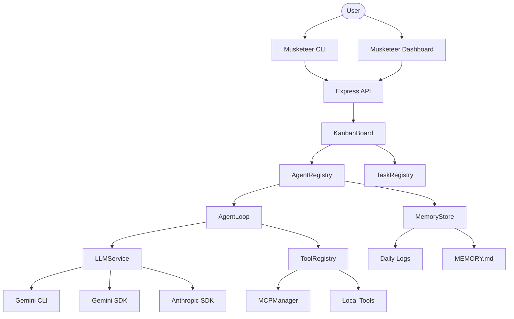

# Architecture: TheMusketeer

**TheMusketeer** is an agentic framework designed for high-velocity, parallel delivery. It follows the **Vibe Kanban** methodology.

## System Overview

## Core Components

### 1. KanbanBoard (`src/core/KanbanBoard.ts`)

The central orchestrator. It manages the state of all tasks and agents. It also handles assignment logic (Auto-assigning tasks based on priority and dependencies).

### 2. LLMService (`src/core/llm/LLMService.ts`)

A provider-agnostic bridge to various LLMs. It supports:

- **Gemini CLI**: Wraps `@google/gemini-cli` for zero-config execution.
- **Gemini/Anthropic SDKs**: Direct API integrations for low-latency.

### 3. MCPManager (`src/core/mcp/MCPManager.ts`)

Implements the **Model Context Protocol**. It connects to external servers (e.g., Filesystem, GitHub) and dynamically imports tools into the agent's toolbox.

### 4. MemoryStore (`src/core/MemoryStore.ts`)

Inspired by **OpenClaW**. It maintains context across agent spawns using hierarchical Markdown files.

## High-Velocity Workflow (Vibe Kanban)

1. **Parallel Spawning**: Multiple agents are spawned simultaneously for independent tasks.
2. **Autonomous Verification**: Agents use terminal access to run tests and verify their own work.
3. **Collective Memory**: Agents share context through the MemoryStore, ensuring alignment without central control.
